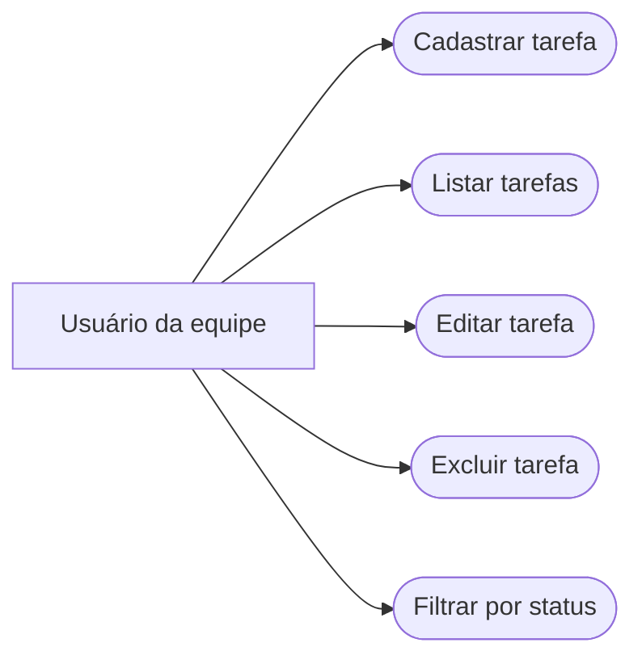
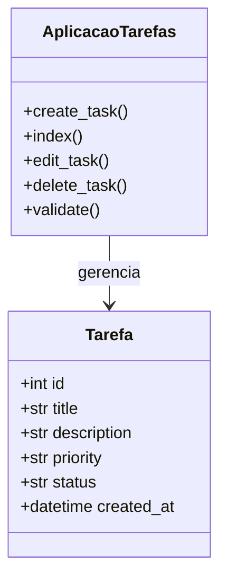

# Diagramas UML (Mermaid)

## Casos de uso (representação textual UML)

```mermaid
flowchart LR
 U[Usuário da equipe] --> A([Cadastrar tarefa])
 U --> B([Listar tarefas])
 U --> C([Editar tarefa])
 U --> D([Excluir tarefa])
 U --> E([Filtrar por status])
```

## Classes (modelo conceitual)

```mermaid
classDiagram
 class Tarefa {
   +int id
   +str title
   +str description
   +str priority
   +str status
   +datetime created_at
 }
 class AplicacaoTarefas {
   +create_task()
   +index()
   +edit_task()
   +delete_task()
   +validate()
 }
 AplicacaoTarefas --> Tarefa : gerencia
```
